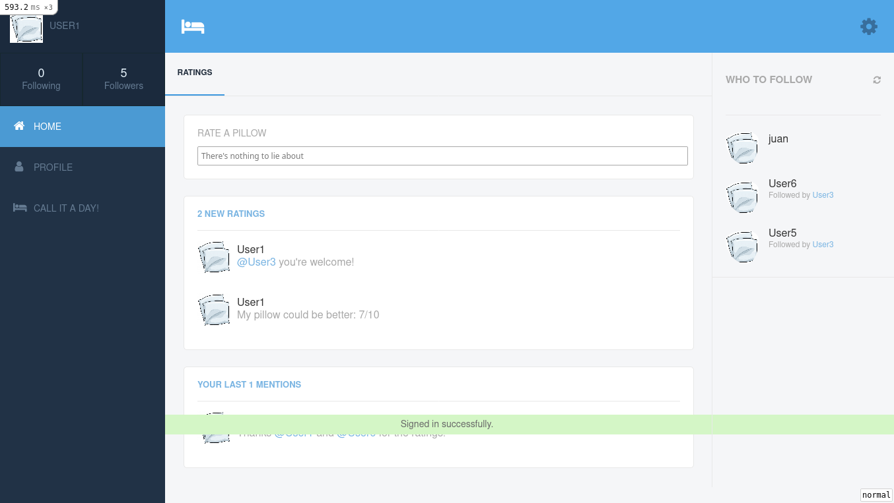
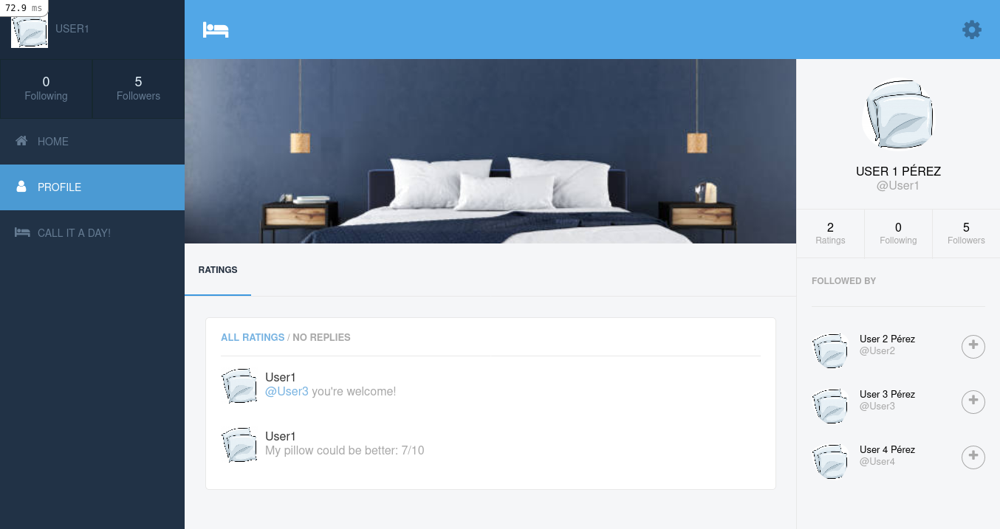

# DoLie

> MVP of a social media app for sharing mattresses, pillows and other comfy stuff ratings. It features users, short opinions, and mentions. Inspired by twitter.

## Built With

- Ruby v3.0.2
- Ruby on Rails v6.1.4

## Screenshot

#### [Live version](https://fierce-river-41660.herokuapp.com/)

## Getting Started

To get a local copy up and running follow these simple example steps.

### Prerequisites

- Ruby v3.0.2
- Ruby on Rails v6.1.4
- Postgres: >=9.5

### Setup

Follow these steps to get a working copy in your local environment:
**You will need Postgresql properly configured in your computer in order to get a local copy up and running. Instructions on how to configure Postgresql exceed these instructions.**

- In your terminal application, run `git clone https://github.com/notlfish/DoLie.git` to copy the project
- Run `cd DoLie` to get into the project's root directory
- Run `bundle intall` to install the project's dependencies:
- Run `bundle exec rails db:create && bundle exec rails db:migrate` to set up the database. **You only do this once**

### Usage

After you set up the project and the database:
- Run `bundle exec rails server` to start the webapp.
- Open `http://localhost:3000/` in your browser.
- Use the pages links to navigate the webapp.

### Run tests
Run test from the project root directory
- `bundle exec rpsec` to run all the test
- `bundle exec rspec spec/models` to run unit tests
- `bundle exec rspec spec/features` to run integration tests.

**Chrome is needed to run the integration tests**

## Authors

👤 **Lucas Ferrari Soto**

- GitHub: [@notlfish](https://github.com/notlfish)
- Twitter: [@LucasFerrariSo1](https://twitter.com/LucasFerrariSo1)
- LinkedIn: [LinkedIn](https://www.linkedin.com/in/lucas-mauricio-ferrari-soto-472a3515a/)

## 🤝 Contributing

Contributions, issues and feature requests are welcome!

Feel free to check the [issues page](issues/).

## Show your support

Give a ⭐️ if you like this project!

## Acknowledgments

Project required by [Microverse](https://www.microverse.org/). Project's design by [Gregoire Vella](https://www.behance.net/gregoirevella) in [Benhance](https://www.behance.net/gallery/14286087/Twitter-Redesign-of-UI-details).

## 📝 License

[MIT](/LICENSE)
